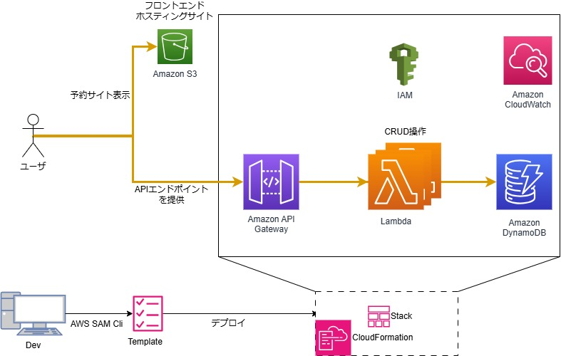
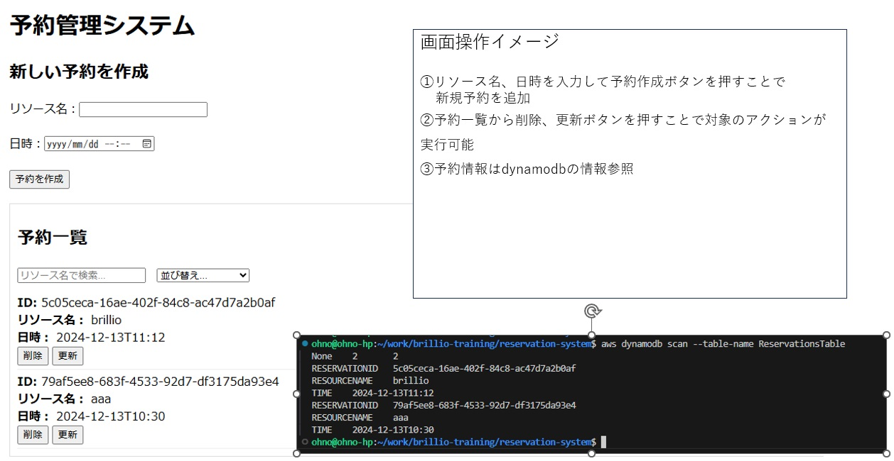

# AWS SAM を用いた予約システム構築手順まとめ

本ドキュメントでは、AWS SAMを活用してDynamoDBをバックエンドとしたシンプルな予約システムを構築・テストし、本番環境へデプロイ。
デプロイしたAPI Gateway + Lambda + DynamoDBで構成されています。  
フロントエンド(HTML,CSS,JS)はS3静的ウェブサイトホスティングを用いて公開します。

**あくまでAWSサービスを使った構築イメージをつかむための手順でセキュリティフル無視なので作成後は必ず削除する。非公開とすること！！**

## 前提条件

- AWS CLI、SAM CLIがインストール済みであること
- AWSアカウントと適切なIAM権限があること
- Python 3.9 ランタイムに対応したローカル開発環境があること
- （ローカルテスト用に）Docker環境が整っていること

## AWS環境構成図




## SAMプロジェクト構成
```
reservation-system/
├── README.md (本ドキュメント)
├── src/
│   ├─ create_reservation.py
│   ├─ get_reservation.py
│   ├─ update_reservation.py
│   ├─ delete_reservation.py
│   ├─ list_reservations.py
├
├── template.yaml
├
├─ env.json
```

## 画面イメージ
デプロイ後のWeb画面イメージ




`template.yaml`では以下を定義します。  
- DynamoDBテーブル `ReservationsTable`
- `CreateReservationFunction`, `GetReservationFunction`, `UpdateReservationFunction`, `DeleteReservationFunction`, `ListReservationsFunction` の5つのLambda関数
- 各FunctionをトリガーするAPI Gateway (パス: `/reservations`など)
- `TABLE_NAME` 環境変数をLambda関数から参照可能にする設定

## SAMプロジェクトのビルド

ソースコード・テンプレートが準備できたら以下を実行します。

```bash
sam build
```

これでtemplate.yamlに基づき、Lambda用のパッケージが.aws-sam/build配下に生成されます。

## ローカルでのテスト (オプション)
### ローカルDynamoDBの準備

1. DynamoDB Local起動

```
docker run -p 8000:8000 amazon/dynamodb-local
```

2. テーブル作成
```
aws dynamodb create-table \
    --table-name ReservationsTable \
    --attribute-definitions AttributeName=reservationId,AttributeType=S \
    --key-schema AttributeName=reservationId,KeyType=HASH \
    --provisioned-throughput ReadCapacityUnits=5,WriteCapacityUnits=5 \
    --endpoint-url http://localhost:8000 \
    --region ap-northeast-1
```
`env.json`などで`TABLE_NAME`を設定して、ローカルで`sam local start-api`実行時にLambdaへ環境変数を渡す。


### SAMローカル起動
```
sam local start-api --env-vars env.json
```

- http://127.0.0.1:3000でAPIが起動
- curlコマンドでPOST /reservationsなどを実行し、ローカル環境での動作を確認
  ```
  curlの実行例を記載
  ```

### 本番用へのコード修正とデプロイ
ローカルで確認後、本番環境用に以下を修正

- `endpoint_url`や`aws_access_key_id/aws_secret_access_key`の削除（デフォルト設定に戻す）
- `dynamodb = boto3.resource('dynamodb')` のみでアクセス可能な状態
- 認証なし公開で良いかといったデプロイ時の質問に対応できるようにする

1. 再ビルド
```
sam build
```

2. デプロイ
```
sam deploy --guided --region ap-northeast-1
```
デプロイ時の質問を書いてあげないと厳しい？

```
ログに表示されるOutputsの以下項目がアクセスURLとなる。
Outputs                                                                            -----------------------------------------------------------------------------------
Key                 ApiUrl                                                                                                                                                                
Description         API endpoint URL                                                                                                                                                      
Value               https://<XXXXXXXX>.ap-northeast-1.amazonaws.com/Prod/reservations                                                                       -----------------------------------------------------------------------------------
```

### 本番環境での動作確認 (curl)

**予約作成 (POST)**
```
curl -X POST -H "Content-Type: application/json" \
  -d '{"resourceName":"一番館","time":"2024-12-11T10:00"}' \
  https://<XXXXXXXX>.ap-northeast-1.amazonaws.com/Prod/reservations
```

**予約取得 (GET)**
```
curl https://<XXXXXXXX>.ap-northeast-1.amazonaws.com/Prod/reservations/ <reservationId>
```

**予約更新 (PUT)**
```
curl -X PUT -H "Content-Type: application/json" \
  -d '{"resourceName":"弐番館,"time":"2024-12-12T10:00"}' \
  https://<XXXXXXXX>.ap-northeast-1.amazonaws.com/Prod/reservations/<reservationId>
```

**予約削除 (DELETE)**
```
curl -X DELETE \
  https://<XXXXXXXX>.ap-northeast-1.amazonaws.com/Prod/reservations/<reservationId>
```

**一覧取得 (GET)**
```
curl https://<XXXXXXXX>.ap-northeast-1.amazonaws.com/Prod/reservations
```

### 静的サイトホスティング

#### 手順概要
1. **S3バケット作成**
2. **バケットポリシーでパブリックアクセスを許可** (本来CloudFront経由であるべきは触れないこと)
3. **静的ウェブサイトホスティング有効化**  
4. **HTML/CSS/JSファイルをアップロード**
5. **S3ウェブサイトエンドポイントURLでブラウザからアクセス可能**


#### 詳細手順
1.**S3バケット作成**
```
ユニークである必要があるため適宜名前は変更すること

aws s3 mb s3://my-reservation-frontend
```
#### パブリックアクセス許可設定
```
json
{
  "Version": "2012-10-17",
  "Statement": [
    {
      "Sid": "PublicReadGetObject",
      "Effect": "Allow",
      "Principal": "*",
      "Action": "s3:GetObject",
      "Resource": "arn:aws:s3:::my-reservation-frontend/*"
    }
  ]
}

```

続く～～～～～～～～～～


### トラブルシューティング
詰まるポイントはローカルテスト部分ぐらい
XXXXXXXX

### まとめ
XXXXXXXX


残タスク
別途、簡単な予約画面を用意しておく（HTML,CSS,JS）
前提となる環境構築手順は別途準備
